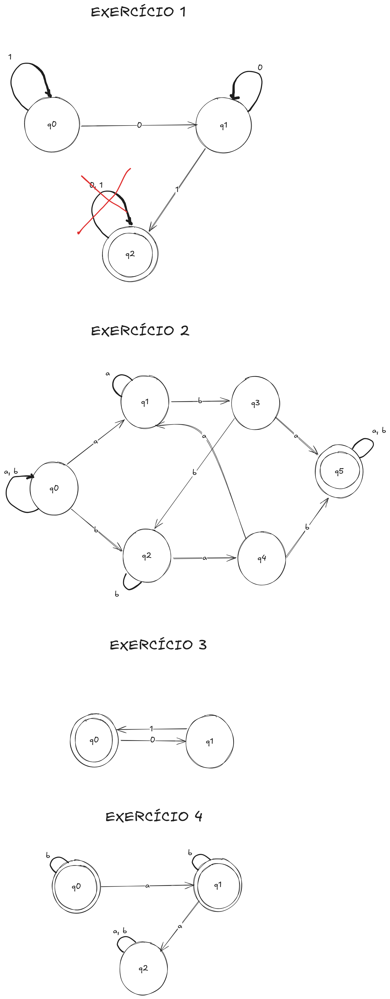

# Construção de Autômatos

## 1. Autômatos Finitos Determinísticos (AFD)

### 1.1 Definição Formal de um AFD

Um AFD é uma 5-tupla \( (Q, Σ, δ, q_0, F) \), onde:

- \( Q \): conjunto finito de estados
- Σ: alfabeto finito de símbolos de entrada
- δ: função de transição \( δ: Q × Σ → Q \)
- \( q_0 \): estado inicial \( q_0 ∈ Q \)
- \( F \): conjunto de estados finais (ou de aceitação) \( F ⊆ Q \)

### 1.2 Como Construir um AFD

Passos para construir um AFD para uma dada linguagem:

1. Identificar o alfabeto Σ.
2. Definir o conjunto de estados \( Q \), pensando nos "estados de memória" necessários para reconhecer a linguagem.
3. Definir o estado inicial \( q_0 \).
4. Definir o conjunto de estados finais \( F \).
5. Definir a função de transição δ, mapeando cada par (estado, símbolo) para o próximo estado. Cada estado deve ter exatamente uma transição para cada símbolo do alfabeto.

### 1.3 Exemplo de Construção de um AFD

Construir um AFD que reconheça a linguagem de todas as palavras sobre \( \{a, b\} \) que contêm um número par de 'a's.

- Σ = \( \{a, b\} \)
- \( Q = \{q_0, q_1\} \) onde \( q_0 \) representa um número par de 'a's e \( q_1 \) um número ímpar.
- Estado inicial: \( q_0 \)
- Estados finais: \( F = \{q_0\} \) (pois queremos um número par de 'a's)
- Função de transição δ:
  - \( δ(q_0, a) = q_1 \)
  - \( δ(q_0, b) = q_0 \)
  - \( δ(q_1, a) = q_0 \)
  - \( δ(q_1, b) = q_1 \)

## 2. Autômatos Finitos Não Determinísticos (AFN)

### 2.1 Definição Formal de um AFN

Um AFN é uma 5-tupla \( (Q, Σ, δ, q_0, F) \), onde:

- \( Q \): conjunto finito de estados
- Σ: alfabeto finito de símbolos de entrada
- δ: função de transição \( δ: Q × (Σ ∪ {ε}) → ℙ(Q) \) (o conjunto das partes de \( Q \))
- \( q_0 \): estado inicial \( q_0 ∈ Q \)
- \( F \): conjunto de estados finais (ou de aceitação) \( F ⊆ Q \)

A diferença principal para o AFD é a transição: um estado pode ter zero, uma ou várias transições para o mesmo símbolo, e também transições espontâneas (ε-transições) sem consumir um símbolo de entrada. O autômato aceita uma palavra se houver _pelo menos um_ caminho de computação que termine em um estado final.

### 2.2 Como Construir um AFN

A construção de um AFN é muitas vezes mais intuitiva do que a de um AFD, especialmente a partir de expressões regulares. Podemos usar a não determinismo para explorar múltiplas possibilidades simultaneamente.

### 2.3 Exemplo de Construção de um AFN

Construir um AFN que reconheça a linguagem de todas as palavras sobre \( \{a, b\} \) que contêm a subpalavra "ab".

- Σ = \( \{a, b\} \)
- \( Q = \{q_0, q_1, q_2\} \)
- Estado inicial: \( q_0 \)
- Estados finais: \( F = \{q_2\} \)
- Função de transição δ:
  - \( δ(q_0, a) = \{q_0, q_1\} \) (Pode ficar no \( q_0 \) lendo 'a', ou ir para \( q_1 \) esperando 'b')
  - \( δ(q_0, b) = \{q_0\} \)
  - \( δ(q_1, a) = ∅ \)
  - \( δ(q_1, b) = \{q_2\} \)
  - \( δ(q_2, a) = \{q_2\} \) (Continua no estado final lendo 'a' ou 'b')
  - \( δ(q_2, b) = \{q_2\} \)

### 2.4 Transições Epsilon (ε)

As transições epsilon são transições "espontâneas" em um AFN, que ocorrem sem consumir nenhum símbolo da fita de entrada. Elas são representadas pela letra grega épsilon (ε).

**Quando usar transições epsilon:**

- **União de linguagens:** Ao construir um AFN para a união de duas linguagens \(L_1\) e \(L_2\), podemos criar um novo estado inicial e adicionar transições epsilon deste novo estado para os estados iniciais dos AFNs que reconhecem \(L_1\) e \(L_2\).
- **Concatenação de linguagens:** Para a concatenação de \(L_1\) e \(L_2\), podemos adicionar transições epsilon dos estados finais do AFN de \(L_1\) para o estado inicial do AFN de \(L_2\).
- **Fechamento de Kleene:** Ao construir um AFN para \(L^\*\), usamos transições epsilon para permitir zero ou mais repetições da linguagem \(L\) e para incluir a palavra vazia (ε).
- **Simplificação da construção:** Em alguns casos, o uso de transições epsilon pode simplificar a estrutura do AFN durante a construção, especialmente a partir de expressões regulares.

Elas permitem que o autômato mude de estado "gratuitamente", explorando diferentes caminhos de computação simultaneamente sem processar um símbolo.

## 3. Exercícios de Construção de Autômatos

**Instrução:** Para cada item abaixo, construa o autômato (AFD ou AFN, o que for mais simples ou especificado) que reconhece a linguagem descrita. Desenhe o diagrama de estados do autômato.

### Exercício 1: Construção de AFD

Construa um AFD que reconheça a linguagem de todas as palavras sobre \( \{0, 1\} \) que terminam com "01".

```
δ(q0, 0) -> (q1)
δ(q0, 1) -> (q0)
δ(q1, 0) -> (q1)
δ(q1, 1) -> (q2)
δ(q2, 0) -> (q2)
δ(q2, 1) -> (q2)
```

<!-- SOLUÇÃO E EXPLICAÇÃO DIDÁTICA -->

**Explicação:**
Para reconhecer palavras que terminam com "01", precisamos de um autômato que lembre os dois últimos símbolos lidos. O autômato abaixo faz isso:

- **Estados:**
  - q0: estado inicial, não viu nada relevante ainda.
  - q1: o último símbolo lido foi '0'.
  - q2: os dois últimos símbolos lidos foram "01" (estado de aceitação).
- **Estado inicial:** q0
- **Estado final:** q2
- **Transições corrigidas:**

| Estado | 0   | 1   |
| ------ | --- | --- |
| q0     | q1  | q0  |
| q1     | q1  | q2  |
| q2     | q1  | q0  |

- **Exemplos aceitos:** "01", "1001", "11001", "0001"
- **Exemplos rejeitados:** "10", "11", "101", "0", "1"

**Autoavaliação:**
Tente criar palavras que terminam e não terminam com "01" e simule o funcionamento do autômato.

---

### Exercício 2: Construção de AFN

Construa um AFN que reconheça a linguagem de todas as palavras sobre \( \{a, b\} \) que contêm a subpalavra "aba" ou "bab".

```
δ(q0, a) -> (q0, q1)
δ(q0, b) -> (q0, q2)
δ(q1, a) -> (q1)
δ(q1, b) -> (q3)
δ(q2, a) -> (q4)
δ(q2, b) -> (q2)
δ(q3, a) -> (q5)
δ(q3, b) -> (q2)
δ(q4, a) -> (q1)
δ(q4, b) -> (q5)
δ(q5, a) -> (q5)
δ(q5, b) -> (q5)
```

<!-- SOLUÇÃO E EXPLICAÇÃO DIDÁTICA -->

**Explicação:**
O AFN usa não determinismo para tentar reconhecer "aba" ou "bab" a partir de qualquer posição. O estado q5 é final e representa que já foi reconhecida uma das subpalavras.

- **Estados:**
  - q0: inicial, ainda não viu nada relevante.
  - q1: viu 'a', pode ser início de "aba".
  - q2: viu 'b', pode ser início de "bab".
  - q3: viu "ab", esperando 'a' para "aba".
  - q4: viu "ba", esperando 'b' para "bab".
  - q5: estado final, já reconheceu "aba" ou "bab".
- **Estado inicial:** q0
- **Estado final:** q5
- **Transições:** (veja tabela acima)

- **Exemplos aceitos:** "aba", "bab", "aababb", "baba", "ababa"
- **Exemplos rejeitados:** "aab", "baa", "bba", "aaa", "bbb"

**Autoavaliação:**
Crie palavras que contenham ou não "aba" ou "bab" e simule o funcionamento do autômato.

---

### Exercício 3: Construção a partir de Expressão Regular

Construa um AFN (e depois, se quiser desafiar-se, um AFD equivalente) para a expressão regular `(01)*`.

<!-- SOLUÇÃO E EXPLICAÇÃO DIDÁTICA -->

**Explicação:**
A linguagem contém todas as palavras formadas por zero ou mais repetições da sequência "01". O autômato abaixo reconhece exatamente essas palavras:

- **Estados:**
  - q0: inicial e final (aceita a palavra vazia)
  - q1: após ler '0', esperando '1'
- **Estado inicial:** q0
- **Estado final:** q0
- **Transições:**

  - δ(q0, 0) → q1
  - δ(q1, 1) → q0

- **Exemplos aceitos:** "", "01", "0101", "010101"
- **Exemplos rejeitados:** "0", "1", "10", "011", "001"

**Nota:**
Neste caso, o AFN já é determinístico, então ele é também um AFD.

**Autoavaliação:**
Crie palavras e verifique se são compostas apenas por repetições de "01".

---

### Exercício 4: Linguagem mais Complexa

Construa um AFD que reconheça a linguagem de todas as palavras sobre \( \{a, b\} \) que não contêm a subpalavra "aa".

<!-- SOLUÇÃO E EXPLICAÇÃO DIDÁTICA -->

**Explicação:**
O autômato precisa "lembrar" se o último símbolo foi 'a'. Se aparecer "aa", vai para um estado de erro e nunca mais aceita.

- **Estados:**
  - q0: inicial, não viu 'a' ainda ou o último símbolo não foi 'a'.
  - q1: o último símbolo foi 'a'.
  - q2: estado de erro (já viu "aa").
- **Estado inicial:** q0
- **Estados finais:** q0, q1
- **Transições:**

| Estado | a   | b   |
| ------ | --- | --- |
| q0     | q1  | q0  |
| q1     | q2  | q0  |
| q2     | q2  | q2  |

- **Exemplos aceitos:** "", "a", "b", "ab", "ba", "bab", "aba", "baba"
- **Exemplos rejeitados:** "aa", "baa", "aab", "baaa"

**Autoavaliação:**
Teste palavras com e sem "aa" e veja se o autômato aceita corretamente.

---


